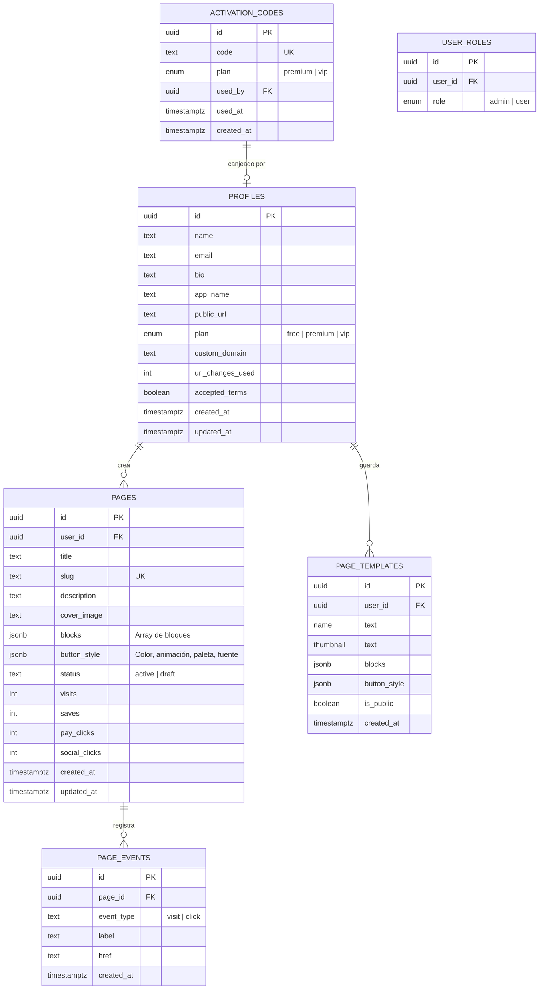
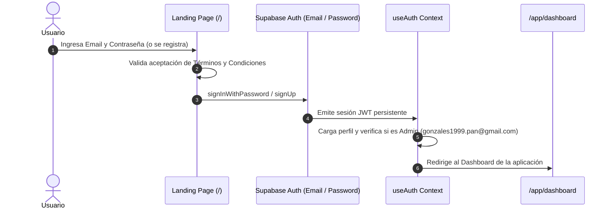

# 🚀 Zentry Link — Documentación Completa de Arquitectura y Funcionamiento

Documento técnico detallado que explica la arquitectura, el funcionamiento integral, el flujo de datos, el modelo de base de datos y la ubicación exacta de cada componente de la plataforma **Zentry Link**.

---

## 📋 Índice
1. [Visión General del Proyecto](#1-visión-general-del-proyecto)
2. [Stack Tecnológico](#2-stack-tecnológico)
3. [Mapa de Archivos y Directorios](#3-mapa-de-archivos-y-directorios)
4. [Modelo de Datos y Base de Datos (Supabase)](#4-modelo-de-datos-y-base-de-datos-supabase)
5. [Flujo de Autenticación y Control de Accesos](#5-flujo-de-autenticación-y-control-de-accesos)
6. [Lógica de Planes y Paywall (Free, Premium, VIP)](#6-lógica-de-planes-y-paywall-free-premium-vip)
7. [Rutas y Funcionamiento por Módulos](#7-rutas-y-funcionamiento-por-módulos)
   - [Landing Page y Autenticación (`/`)](#landing-page-y-autenticación-)
   - [Layout Principal de la App (`/app`)](#layout-principal-de-la-app-app)
   - [Dashboard Analítico en Tiempo Real (`/app/dashboard`)](#dashboard-analítico-en-tiempo-real-appdashboard)
   - [Gestión de Páginas (`/app/pages`)](#gestión-de-páginas-apppages)
   - [Constructor Visual / Page Builder (`/app/builder/$id`)](#constructor-visual--page-builder-appbuilderid)
   - [Links Públicos y Dominios (`/app/links`)](#links-públicos-y-dominios-applinks)
   - [Estadísticas Detalladas (`/app/stats`)](#estadísticas-detalladas-appstats)
   - [Suscripción y Códigos (`/app/subscription`)](#suscripción-y-códigos-appsubscription)
   - [Configuración de Perfil (`/app/settings`)](#configuración-de-perfil-appsettings)
   - [Panel de Administración (`/app/admin`)](#panel-de-administración-appadmin)
   - [Visualizador Público de Páginas (`/$` y `/p/$slug`)](#visualizador-público-de-páginas--y-pslug)
8. [Componentes Reutilizables Clave](#8-componentes-reutilizables-clave)
9. [Sistema de Optimización Automática de Archivos HTML y CDN](#9-sistema-de-optimización-automática-de-archivos-html-y-cdn)
10. [Flujo de Tracking y Analíticas (Botones y Páginas HTML)](#10-flujo-de-tracking-y-analíticas-botones-y-páginas-html)
11. [Guía para Desarrolladores y Despliegue en Vercel](#11-guía-para-desarrolladores-y-despliegue-en-vercel)

---

## 1. Visión General del Proyecto

**Zentry Link** es una plataforma SaaS de alto rendimiento desarrollada para **Zentry Company**, diseñada como un alojador y constructor de páginas web de venta, calculadoras interactivas, aplicaciones web en HTML y micro-sitios tipo bio-link optimizados para dispositivos móviles.

### Características Principales:
- **Alojamiento y Publicación Instantánea:** Sube y publica páginas HTML completas, calculadoras interactivas, páginas de venta y recetarios en segundos con URL pública limpia y dominio propio.
- **Constructor Visual en Tiempo Real:** 3 paneles (Elementos/Plantillas a la izquierda, Formulario de edición al centro, Previsualizador iPhone 15 interactivo de 360px y altura dinámica a la derecha).
- **Optimizador Automático de Imágenes Base64:** Extrae automáticamente imágenes pesadas Base64 de los HTML importados y las aloja en el CDN de Supabase Storage para reducir el tamaño de las páginas hasta en un 99% y permitir cargas instantáneas.
- **Soporte de Bloques:** Títulos, Texto, Imágenes, Galerías con carrusel, Ingredientes, Pasos, Videos (YouTube/Vimeo/Drive), Redes sociales, Botones animados y Bloques HTML completos con edición bidireccional y polyfill de almacenamiento seguro.
- **Analíticas Integradas en Vivo:** Métricas en tiempo real de visitas, clics en botones de compra/enlaces externos (incluyendo botones dentro de páginas HTML importadas) y tasas de conversión mediante gráficos de Recharts.
- **Carga Ultrarrápida SSR (Server-Side Rendering):** Server Loaders directos que entregan las páginas públicas pre-renderizadas en menos de 1 segundo sin parpadeos ni pantallas vacías al refrescar.
- **Sistema de Monetización multinivel:** Planes Free, Premium ($5/mes) y VIP ($10/mes) con validación mediante códigos de activación canjeables en servidor.

---

## 2. Stack Tecnológico

| Capa / Herramienta | Tecnología | Propósito |
| :--- | :--- | :--- |
| **Framework Frontend & SSR** | [TanStack Start](https://tanstack.com/start) + [React 19](https://react.dev/) | SSR (Server-Side Rendering) y Server Loaders para carga instantánea. |
| **Enrutamiento** | [TanStack Router](https://tanstack.com/router) | Enrutador fuertemente tipado con generación de árbol (`routeTree.gen.ts`). |
| **Estado y Caché Servidor** | [TanStack Query v5](https://tanstack.com/query) | Manejo de peticiones asíncronas, caching e invalidación en tiempo real. |
| **Estilos y Diseño** | [Tailwind CSS v4](https://tailwindcss.com/) + CSS Variables | Tema Dark Mode Premium (#0B0F19) con efectos Glow Neón (`--neon-violet`, `--neon-cyan`, `--neon-green`). |
| **Animaciones** | [Framer Motion](https://www.framer.com/motion/) | Animaciones de interfaz, listas reordenables y transiciones de entrada/salida. |
| **Gráficos** | [Recharts](https://recharts.org/) | Gráficas lineales interactivas de analíticas con gradientes neón. |
| **Backend & Base de Datos** | [Supabase](https://supabase.com/) (PostgreSQL) | Base de datos relacional, Auth nativo, Row Level Security (RLS) y Supabase Storage (`page-assets`). |
| **Autenticación** | Supabase Auth (Email y Contraseña) | Registro e inicio de sesión directo por correo y contraseña con sesiones seguras JWT. |
| **Alojamiento & Hosting** | [Vercel](https://vercel.com/) | Despliegue global en la nube con CI/CD automático conectado a GitHub. |
| **Componentes UI** | [Radix UI](https://www.radix-ui.com/) + [Lucide React](https://lucide.dev/) | Primitivas accesibles (Diálogos, Acordeones, Menús, Sheets, Alertas) y set de iconos. |
| **Notificaciones** | [Sonner](https://sonner.emilkowal.ski/) | Toasts flotantes para feedback inmediato. |
| **Empaquetador** | [Vite 7](https://vitejs.dev/) + Nitro | Compilación ultrarrápida para producción. |

---

## 3. Mapa de Archivos y Directorios

```
zentry-link-builder-main/
├── .env                                # Variables de entorno de Supabase (URL y Anon Key)
├── package.json                        # Dependencias y scripts de ejecución
├── vite.config.ts                      # Configuración de Vite, TanStack Router y Tailwind CSS
├── wrangler.jsonc                      # Configuración para Cloudflare Workers / Nitro
├── ESTRUCTURA_Y_FUNCIONAMIENTO.md      # Guía técnica de arquitectura y funcionamiento
├── HISTORIAL_DE_ACTUALIZACIONES.md     # Registro cronológico de cambios y optimizaciones
│
├── supabase/
│   ├── config.toml                     # Configuración del proyecto local de Supabase
│   └── migrations/                     # Migraciones SQL con esquema, triggers y RPCs
│
└── src/
    ├── server.ts                       # Punto de entrada del servidor SSR
    ├── start.ts                        # Configuración de TanStack Start y middlewares
    ├── router.tsx                      # Instanciación de TanStack Router con QueryClient
    ├── routeTree.gen.ts                # Árbol de rutas generado automáticamente
    ├── styles.css                      # Estilos globales, variables CSS neón y animaciones
    │
    ├── integrations/
    │   └── supabase/
    │       ├── client.ts               # Cliente Supabase para el frontend (anon key)
    │       ├── client.server.ts        # Cliente Supabase admin con service_role key
    │       ├── types.ts                # Tipos TypeScript generados de la base de datos
    │       ├── auth-attacher.ts        # Middleware para inyectar token de auth
    │       └── auth-middleware.ts      # Middleware para validar sesión en Server Functions
    │
    ├── lib/
    │   ├── plan.ts                     # Definición de límites y hook usePlan()
    │   ├── themes.ts                   # Catálogo de 10 paletas de color y 6 Google Fonts
    │   ├── public-url.ts               # Generador dinámico de URLs públicas y dominios CNAME
    │   ├── subscription.functions.ts   # Server function para canje seguro de códigos
    │   ├── utils.ts                    # Utilidad cn() (clsx + tailwind-merge)
    │   ├── error-capture.ts            # Captura y normalización de errores en SSR
    │   ├── error-page.ts               # Renderizado de página 500 corporativa
    │   └── hooks/
    │       └── use-auth.tsx            # Contexto AuthProvider y hook useAuth()
    │
    ├── components/
    │   ├── ZentryLogo.tsx              # Logo 3D cristalino y Wordmark Zentry Link
    │   ├── PhoneFrame.tsx              # Marco visual iPhone 15 Pro (360px x altura adaptable)
    │   ├── PublicPageView.tsx          # Renderizador público limpio con tracking de clics en HTML
    │   ├── HtmlIframe.tsx              # Iframe responsive interactivo con polyfill de Storage
    │   ├── ImageUploader.tsx           # Componente de subida a Supabase Storage (bucket page-assets)
    │   ├── PaywallModal.tsx            # Modal de bloqueo Pro con gradiente y llamada a acción
    │   ├── SocialIcons.tsx             # Iconos vectoriales de YouTube, TikTok, Instagram, etc.
    │   └── ui/                         # Componentes base Radix (button, dialog, input, etc.)
    │
    └── routes/
        ├── __root.tsx                  # Layout raíz HTML, meta tags SEO y AuthProvider
        ├── index.tsx                   # Landing page Alojador Web con Modal de Login/Registro por Email
        ├── $.tsx                       # Catch-all: Server Loader /{slug} público o fallback
        ├── p.$slug.tsx                 # Alias de compatibilidad para enlaces /p/{slug}
        ├── app.tsx                     # Layout autenticado con Sidebar lateral y Topbar móvil
        ├── app.index.tsx               # Redirige /app a /app/dashboard
        ├── app.dashboard.tsx           # Panel de métricas en tiempo real y gráficos en vivo
        ├── app.pages.tsx               # Listado, estado y eliminación de páginas creadas
        ├── app.builder.index.tsx       # Redirige /app/builder a /app/builder/new
        ├── app.builder.$id.tsx         # Constructor visual (con optimizador Base64 y preview móvil)
        ├── app.links.tsx               # Gestión de slugs y configuración de dominio propio
        ├── app.mobile.tsx              # Vista previa móvil aislada de la última página
        ├── app.stats.tsx               # Analíticas detalladas por página (desglose de clics por botón)
        ├── app.subscription.tsx        # Tabla de planes y canje de códigos de activación
        ├── app.settings.tsx            # Formulario de perfil y datos de sitio / marca
        └── app.admin.tsx               # Panel de administración (solo admin autorizado)
```

---

## 4. Modelo de Datos y Base de Datos (Supabase)

La base de datos PostgreSQL en Supabase almacena perfiles, páginas, eventos de analítica, plantillas y códigos de activación:



---

## 5. Flujo de Autenticación y Control de Accesos



### Reglas de Navegación y Seguridad:
- **Autenticación por Correo y Contraseña:** Inicio de sesión y registro directo sin depender de servicios externos de terceros.
- **Protección Global de `/app/*`:** Si un usuario sin sesión intenta entrar a cualquier ruta interna, es redirigido inmediatamente a la raíz `/`.
- **Ruta Admin Estricta (`/app/admin`):** Solo accesible para el correo del administrador maestro (`gonzales1999.pan@gmail.com`).
- **Trigger Automático `handle_new_user`:** Al registrar el correo del administrador, la base de datos le otorga de forma automática el rol `admin` y el plan `VIP`.

---

## 6. Lógica de Planes y Paywall (Free, Premium, VIP)

El archivo `src/lib/plan.ts` define los límites por plan:

| Característica | Plan Gratuito (Free) | Plan Premium ($5) | Plan VIP ($10) |
| :--- | :---: | :---: | :---: |
| **Límite de páginas** | 1 página | 10 páginas | **Ilimitadas** |
| **Imágenes por página** | 1 imagen | 4 imágenes HD | **Ilimitadas** |
| **Colores y estilos de botón** | Predeterminado | Personalizados | Personalizados |
| **Modificación de Slug / URL** | Bloqueado | 2 cambios | **Ilimitados** |
| **Dominio Propio (CNAME)** | ❌ No | ✅ Sí | ✅ Sí |
| **Plantillas externas / JSON** | ❌ No | ❌ No | ✅ Sí |
| **Importación y Alojamiento HTML** | ❌ No | ❌ No | ✅ **Ilimitado** |
| **Marca de agua Zentry** | Visible | Removida | Removida |

---

## 7. Rutas y Funcionamiento por Módulos

### Landing Page y Autenticación (`/`)
- **Archivo:** `src/routes/index.tsx`
- **Función:** Página de presentación como plataforma líder de alojamiento y lanzamiento de páginas de venta, calculadoras y micro-sitios web. Incluye modal de inicio de sesión y registro por email y contraseña.

### Layout Principal de la App (`/app`)
- **Archivo:** `src/routes/app.tsx`
- **Función:** Sidebar fija de navegación con acceso a Dashboard, Mis Páginas, Constructor Visual, Enlaces Públicos, Vista Móvil, Estadísticas, Suscripción, Configuración y Panel de Administración.

### Dashboard Analítico en Tiempo Real (`/app/dashboard`)
- **Archivo:** `src/routes/app.dashboard.tsx`
- **Función:** Consulta en vivo los eventos de la tabla `page_events` para mostrar:
  - Páginas publicadas activas.
  - Visitas totales y visitas del mes.
  - Clics totales en botones de compra.
  - Tasa de conversión porcentual real.
  - Gráfica interactiva de visitas vs clics de los últimos 14 días.

### Gestión de Páginas (`/app/pages`)
- **Archivo:** `src/routes/app.pages.tsx`
- **Función:** Listado de páginas del usuario con copiado de enlace público en 1 clic, estado activo/borrador y eliminación con confirmación.

### Constructor Visual / Page Builder (`/app/builder/$id`)
- **Archivo:** `src/routes/app.builder.$id.tsx`
- **Función:**
  1. **Panel Izquierdo:** Adición de bloques y botón **"Importar HTML"** con optimizador automático de imágenes.
  2. **Panel Central:** Edición de propiedades, URLs, estilos y animaciones.
  3. **Panel Derecho (PhoneFrame):** Previsualización en iPhone 15 Pro de 360px de ancho y altura ampliada (`calc(100vh - 110px)` max 850px) con edición bidireccional interactiva.

### Visualizador Público de Páginas (`/$` y `/p/$slug`)
- **Archivos:** `src/routes/$.tsx` y `src/routes/p.$slug.tsx`
- **Función:** Server Loader SSR que consulta Supabase en el servidor en ~50ms y entrega la página completamente renderizada en menos de 1 segundo, manteniendo el estado para evitar pantallas vacías al refrescar.

---

## 8. Componentes Reutilizables Clave

| Componente | Ubicación | Descripción |
| :--- | :--- | :--- |
| **`PhoneFrame`** | `src/components/PhoneFrame.tsx` | Chasis iPhone 15 Pro de 360px con Dynamic Island no invasiva, barra de estado y altura adaptable a la pantalla. |
| **`HtmlIframe`** | `src/components/HtmlIframe.tsx` | Iframe con polyfill de `localStorage`/`sessionStorage`, sandbox completo, memoización de `srcDoc` y emisor de clics para analíticas. |
| **`PublicPageView`** | `src/components/PublicPageView.tsx` | Renderizador público limpio a pantalla completa con tracking automático de visitas y clics. |
| **`ImageUploader`** | `src/components/ImageUploader.tsx` | Subida directa de imágenes al bucket `page-assets` en Supabase Storage. |
| **`PaywallModal`** | `src/components/PaywallModal.tsx` | Modal con oferta de actualización para planes Free. |

---

## 9. Sistema de Optimización Automática de Archivos HTML y CDN

Para evitar que archivos HTML con imágenes incrustadas en Base64 (que pueden pesar 5 MB a 10 MB) ralenticen la carga:

1. **Detección Automática:** Al importar cualquier archivo HTML en el constructor, la función `optimizeHtmlImages` escanea todas las etiquetas `` que superen los 5 KB.
2. **Conversión y Subida:** Transforma el string Base64 en un archivo binario Blob y lo sube de forma asíncrona al bucket `page-assets` de Supabase Storage.
3. **Reemplazo por URL Pública de Alta Velocidad:** Sustituye el Base64 por la URL directa del CDN (`https://efydortqxworusxwubsb.supabase.co/storage/v1/object/public/page-assets/...`).
4. **Resultado:** El archivo HTML guardado en la base de datos pasa de pesar 5,000 KB a solo 12 KB, permitiendo cargas públicas instantáneas en **~0.6 segundos**.

---

## 10. Flujo de Tracking y Analíticas (Botones y Páginas HTML)

```mermaid
flowchart LR
    A[Visitante abre /{slug}] --> B[PublicPageView registra 'visit']
    B --> C[(Tabla page_events en Supabase)]
    
    A --> D[Visitante hace clic en Botón Normal o Botón dentro de HTML]
    D --> E[HtmlIframe emite mensaje 'zl-public-click']
    E --> F[PublicPageView captura y registra 'click' con label y href]
    F --> C
    
    C --> G[Dashboard y Stats leen eventos en tiempo real y grafican métricas]
```

---

## 11. Guía para Desarrolladores y Despliegue en Vercel

### Repositorio y Producción:
* **GitHub:** `https://github.com/avilanorman85-maker/zentry-link-builder`
* **Vercel:** `https://zentry-link-builder-main.vercel.app`

### Variables de Entorno (`.env`):
```env
SUPABASE_URL=https://efydortqxworusxwubsb.supabase.co
SUPABASE_PUBLISHABLE_KEY=sb_publishable_Qm3rw9onqv9ugF40g6qUGA_sUhSvkH1
VITE_SUPABASE_URL=https://efydortqxworusxwubsb.supabase.co
VITE_SUPABASE_PUBLISHABLE_KEY=sb_publishable_Qm3rw9onqv9ugF40g6qUGA_sUhSvkH1
```

### Comandos de Desarrollo:
```bash
# Instalar dependencias
npm install

# Iniciar en local
npm run dev

# Desplegar a Vercel Producción
npx vercel deploy --prod
```

---
*Documentación técnica oficial de Zentry Link — Zentry Company.*
